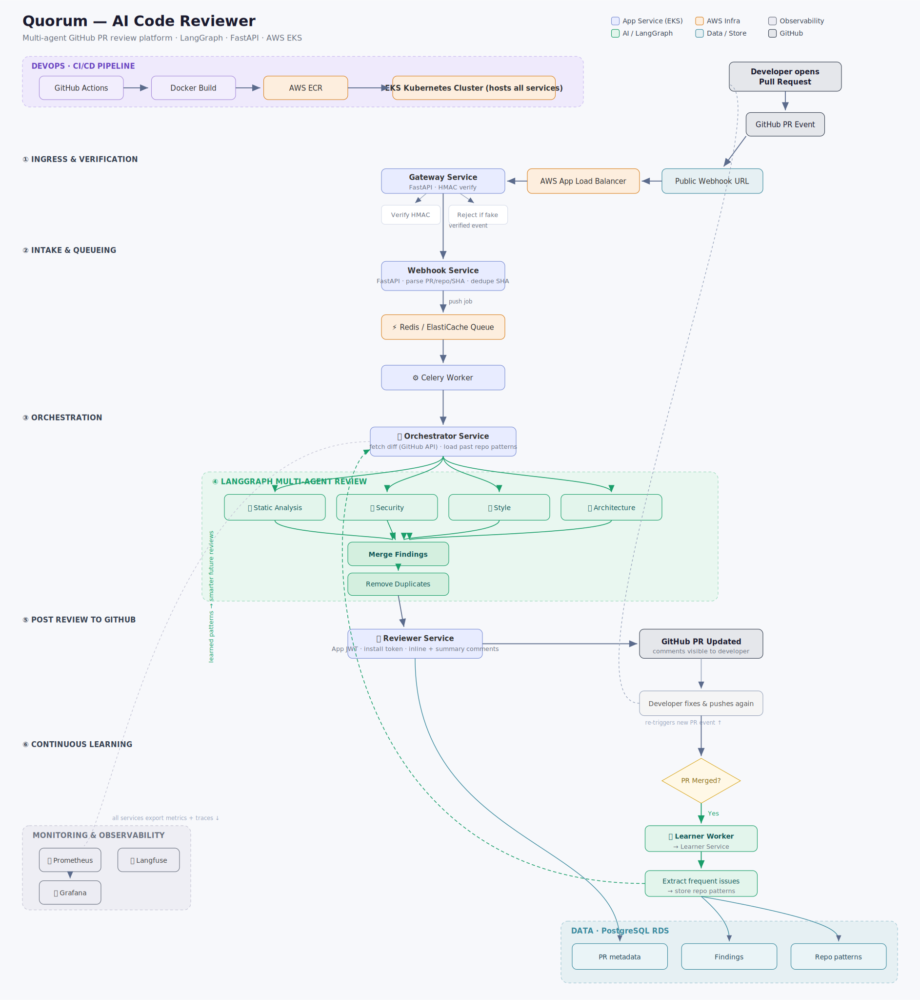

# Quorum — AI-Powered GitHub PR Code Reviewer

A production-grade, multi-agent code review platform that automatically reviews GitHub pull requests using LangGraph and Claude. Four specialized AI agents analyze every PR in parallel, post inline review comments directly on GitHub, and learn from your repository's history to make future reviews smarter.



## How It Works

1. A developer opens a pull request on GitHub
2. A GitHub App webhook fires → verified via HMAC signature at the Gateway
3. The job is queued in Redis and picked up by a Celery worker
4. The Orchestrator fetches the code diff and past repo patterns
5. **Four LangGraph agents review the diff in parallel:**
   - 🔍 **Static Analysis** — complexity, unused variables, naming
   - 🛡 **Security** — OWASP Top 10, hardcoded secrets, SQL injection
   - 🎨 **Style** — formatting, readability, team-specific patterns
   - 🏛 **Architecture** — separation of concerns, error handling, dependencies
6. Findings are merged, deduplicated, and posted as inline + summary comments on the PR
7. When a PR is merged, the Learner Service extracts recurring issues and stores repo patterns — future reviews get smarter

## Architecture

| Layer | Technology |
|---|---|
| **AI / Agents** | LangGraph (fan-out/fan-in multi-agent), Claude Sonnet 4.6 |
| **API Services** | FastAPI (Gateway, Webhook, Orchestrator, Reviewer, Learner) |
| **Async Processing** | Celery + Redis (ElastiCache) |
| **Persistence** | PostgreSQL (RDS) — PR metadata, findings, repo patterns |
| **Infrastructure** | AWS EKS, ECR, ALB · Terraform (IaC) |
| **CI/CD** | GitHub Actions with OIDC (no long-lived AWS keys) |
| **Observability** | Langfuse (LLM tracing), Prometheus + Grafana (metrics) |
| **GitHub Integration** | GitHub App (JWT auth, webhooks, PR comments API) |

## Key Design Decisions

**Multi-agent fan-out with safe state reduction.** Each agent writes findings to an accumulated `raw_findings` channel (`operator.add` reducer); the merge node dedupes and writes the final result to a separate non-reduced `findings` channel. This avoids the classic LangGraph pitfall where a reducer double-appends merged output.

**OIDC over static credentials.** GitHub Actions assumes an IAM role via OpenID Connect — no AWS access keys stored in GitHub Secrets.

**Webhook signature verification.** Every incoming event is HMAC-verified at the gateway before entering the system; forged requests are rejected at the edge.

**Continuous learning loop.** Merged-PR findings are mined for frequent issues per repository. The style agent's prompt is enriched with these patterns, so reviews adapt to each team's recurring mistakes.

**SHA-level deduplication.** Re-delivered webhooks and force-pushes to the same commit don't trigger duplicate reviews.

## Project Structure

```
ai-code-reviewer/
├── services/
│   ├── gateway/          # HMAC verification, request routing
│   ├── webhook/          # PR event parsing, SHA dedupe, job enqueue
│   ├── orchestrator/     # Diff fetching, pattern loading, graph invocation
│   │   └── graph.py      # LangGraph multi-agent review graph
│   ├── reviewer/         # GitHub App auth, comment posting
│   └── learner/          # Pattern extraction from merged PRs
├── infra/
│   └── terraform/        # EKS, ECR, RDS, ElastiCache, ALB
├── .github/workflows/    # CI/CD pipelines (OIDC → AWS)
├── k8s/                  # Kubernetes manifests / Helm values
└── docker/               # Service Dockerfiles
```

## Local Development

### Prerequisites
- Python 3.11+ · Docker · An Anthropic API key · A GitHub App (see below)

### Setup

```bash
git clone https://github.com/RahulHipparkar/ai-code-reviewer.git
cd ai-code-reviewer

# Python environment (uv)
uv venv && source .venv/bin/activate
uv pip install -r requirements.txt

# Environment variables
cp .env.example .env
# Fill in the values below
```

### Required Environment Variables

```env
ANTHROPIC_API_KEY=sk-ant-...
GITHUB_APP_ID=...
GITHUB_APP_PRIVATE_KEY=...        # contents of the .pem file
GITHUB_WEBHOOK_SECRET=...
DATABASE_URL=postgresql://...
REDIS_URL=redis://...
LANGFUSE_PUBLIC_KEY=pk-lf-...
LANGFUSE_SECRET_KEY=sk-lf-...
LANGFUSE_HOST=https://us.cloud.langfuse.com
```

### Run locally

```bash
docker compose up          # Redis + Postgres
uvicorn services.webhook.main:app --reload --port 8000
celery -A services.orchestrator.worker worker --loglevel=info
```

Use [smee.io](https://smee.io) or ngrok to forward GitHub webhooks to localhost during development.

## Deployment (AWS)

Provisioned entirely with Terraform:

```bash
cd infra/terraform
terraform init
terraform plan
terraform apply
```

This creates the EKS cluster, ECR repositories, RDS PostgreSQL, ElastiCache Redis, and ALB. GitHub Actions builds and pushes images to ECR, then deploys to EKS via Helm — authenticated through OIDC role assumption (`github-actions-ai-reviewer`).

After deployment, update the GitHub App's webhook URL to the ALB endpoint.

## GitHub App Setup

1. Create a GitHub App with:
   - **Permissions:** Contents (read), Pull requests (read & write)
   - **Events:** Pull request
   - **Webhook:** your public endpoint + a strong webhook secret
2. Generate a private key (`.pem`) and note the App ID
3. Install the app on the repositories you want reviewed

## Observability

- **Langfuse** traces every agent generation — inspect prompts, outputs, token usage, and latency per agent per PR
- **Prometheus** scrapes service metrics; **Grafana** dashboards track queue depth, review latency, and error rates

## Roadmap

- [ ] Model tiering — route simple agents to Haiku, complex ones to Sonnet
- [ ] Severity-based comment filtering (suppress `info` on large PRs)
- [ ] Multi-repo pattern sharing across an organization
- [ ] Eval suite with golden PRs to regression-test agent quality

## License

MIT

---

**Author:** Rahul Hipparkar · MS Data Science, CU Boulder
[GitHub](https://github.com/RahulHipparkar) · [LinkedIn](https://www.linkedin.com/in/rahulhipparkar)
